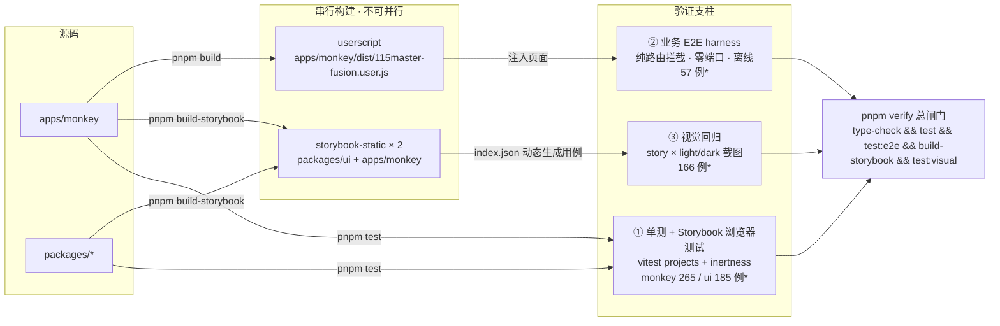
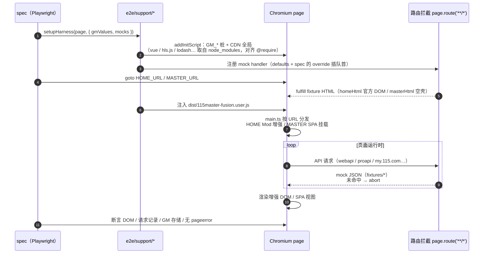
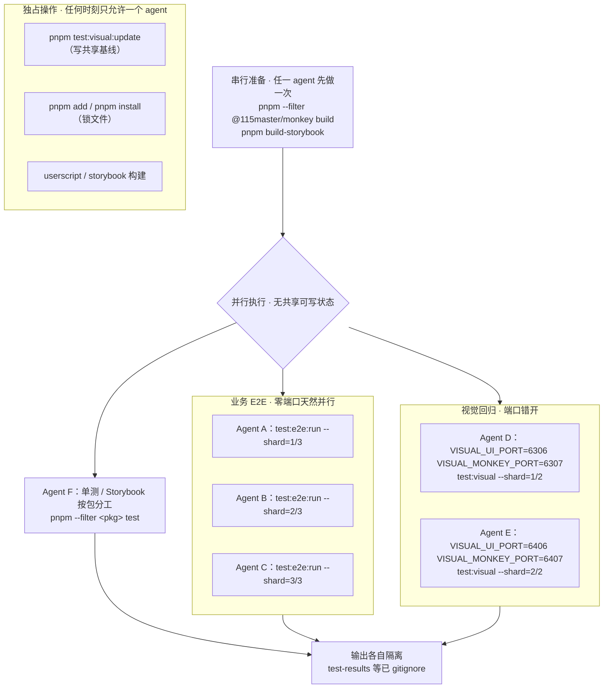

# 验证平台架构图解

三幅图看懂验证平台：整体架构、E2E 运行时、并行 agent 工作流。操作手册见 [verification.md](./verification.md)。

> 图中用例数字（166 / 57 / 265 / 185）为当前快照，会随 story / spec 增加自动增长——E2E 按 spec 文件发现、视觉回归按 `index.json` 动态生成，无需同步改图。

## 平台架构总览

## E2E 运行时

单个 spec 的执行时序（`apps/monkey/e2e/`）。全部网络走 `page.route` 拦截，未 mock 的请求一律 abort（网络沙箱），因此零端口、零服务器、完全离线。

## 并行 agent 工作流

要点：

- E2E 纯路由拦截，无端口无服务器，分片/分工直接并行；按目录分工用 `test:e2e:run specs/<子目录>`（位置参数前不能加 `--`）。
- 视觉回归的唯一共享资源是两个静态服务器端口与基线目录：跑对比错开端口即可并行，更新基线必须串行。
- 构建产物（userscript dist、storybook-static）是所有 agent 的共享输入，构建本身串行做完一次即可。
