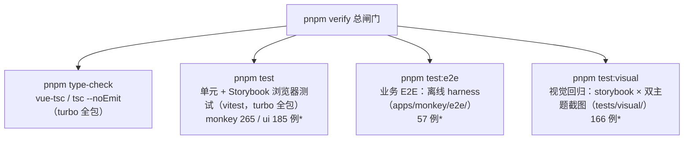

# 验证平台

面向 AI agent 的操作手册：四大验证支柱、命令速查、并行规约、扩展指南与已知限制。

## 支柱概览



> \* 用例数为当前快照，随 story / spec 增加自动增长。平台架构、E2E 运行时与并行工作流的详细图解见 [verification-architecture.md](./verification-architecture.md)。

### ① 单元 + Storybook 浏览器测试（`pnpm test`）

- monkey：`test` = `test:inertness` + `vitest run`。vitest projects：`unit`（node 环境，匹配 `**/__tests__/**/*.test.ts`）、`storybook-dark`、`storybook-light`（chromium headless 真实浏览器，见 `apps/monkey/vitest.config.ts`）。
- ui：`unit` + storybook projects（light / dark / reduced-motion / mobile）。
- a11y：storybook addon-a11y 已接入。monkey 侧 `a11y.test: 'todo'`（存量违规，见「已知限制」），ui 侧 `'error'`。
- inertness：`apps/monkey/.storybook/inertness.json` 登记的 story 会被 Playwright 实际访问（含 reload / 路由切换），断言无 pageerror、无可交互元素发出输入事件、声明的 outcomes 匹配。

### ② 业务 E2E（`apps/monkey/e2e/`）

- Playwright 纯路由拦截：零端口、零服务器、完全离线。单条 `page.route('**/*')` 通配路由按注册顺序匹配 handler；全部不匹配 → abort（网络沙箱，任何未 mock 的请求不会出网）。
- 一键装配：`setupHarness(page, { gmValues, mocks })`（`e2e/support/index.ts`）—— GM_* 桩 + CDN 全局（vue / hls.js 等，文件取自 node_modules，与 `@require` 一一对应）+ mock API + userscript 注入。
- URL 常量：`HOME_URL`（官方首页增强模式）、`MASTER_URL`（独立 SPA）。
- userscript 直接注入 `apps/monkey/dist/115master-fusion.user.js` —— dist 是多 agent 共享的构建产物，跑 E2E 前只需构建一次。

### ③ 视觉回归（`tests/visual/`）

- 读取两套 `storybook-static` 的 `index.json`，动态生成 story × 主题（light/dark）截图用例（当前 166 例）；`subtype === 'test'` 的显式测试条目不参与。
- 静态服务器：`tests/visual/server.mjs`（零依赖），端口 `VISUAL_UI_PORT`（默认 6206）/ `VISUAL_MONKEY_PORT`（默认 6207），可用环境变量覆盖。
- 基线为平台相关：文件名带 `-chromium-darwin` 后缀，存放于 `tests/visual/stories.spec.ts-snapshots/`。

## 命令速查

| 命令 | 作用 | 备注 |
| ---- | ---- | ---- |
| `pnpm test` | 单测 + Storybook 浏览器测试（全包） | 按包分工：`pnpm --filter @115master/ui test` |
| `pnpm test:e2e` | 业务 E2E（先 vite build 再跑） | 含构建，构建不可并行 |
| `pnpm --filter @115master/monkey test:e2e:run` | E2E 跳过构建 | 过滤 `specs/home`；分片 `--shard=i/n`（参数直接追加，不能加 `--`，否则被吞跑全量） |
| `pnpm build-storybook` | 构建两套 `storybook-static` | 视觉回归前置，不可并行 |
| `pnpm test:visual` | 视觉回归 | 端口用 `VISUAL_UI_PORT` / `VISUAL_MONKEY_PORT` 覆盖 |
| `pnpm test:visual:update` | 更新视觉基线 | 独占操作，必须串行 |
| `pnpm verify` | 总闸门 | `type-check && test && test:e2e && build-storybook && test:visual` |

## 并行 agent 规约

多个 agent 同时在本仓库工作时，按以下规约避免互相干扰。

### 串行准备（任一 agent 先做一次）

构建产物共享、构建本身不可并行（会竞争同一输出目录）：

- `pnpm --filter @115master/monkey build` —— E2E 注入的 userscript 产物。
- `pnpm build-storybook` —— 视觉回归消费的 `storybook-static/`（已 gitignore）。

### 并行执行

| 支柱 | 并行方式 |
| ---- | ---- |
| E2E（零端口） | 直接分片 `pnpm --filter @115master/monkey test:e2e:run --shard=i/n`；或按 specs 子目录分工 `pnpm --filter @115master/monkey test:e2e:run specs/<子目录>`（参数均直接追加，不能加 `--`） |
| 视觉回归 | 每个 agent 错开端口：`VISUAL_UI_PORT=6306 VISUAL_MONKEY_PORT=6307 pnpm test:visual --shard=i/n` |
| 单测 / Storybook | 按包分工：`pnpm --filter <pkg> test` |

### 独占操作（不可并行）

- `pnpm test:visual:update` —— 写共享基线目录。
- `pnpm add` / `pnpm install` —— 锁文件。
- userscript / storybook 构建 —— 共享输出目录。

输出目录（`test-results/`、`storybook-static/`）已 gitignore，不会污染提交。

## 扩展指南

### 新增 E2E spec

在 `apps/monkey/e2e/specs/` 下按功能建子目录，模板（对齐 `specs/smoke.spec.ts`）：

```ts
import { expect, test } from '@playwright/test'
import { FILES_RE, json, MASTER_URL, setupHarness, watch } from '../support'

test.describe('<feature>', () => {
  test('<行为>', async ({ page }) => {
    /** 收集 pageerror，用例结束统一断言 */
    const errors = watch(page)

    await setupHarness(page, {
      /** 可选：预设 GM 值（如用户设置） */
      gmValues: { USER_SETTINGS: { enableFilelistPreview: false } },
      /** 可选：覆盖默认 mock（override 先于默认匹配） */
      mocks: api => api.override(FILES_RE, ({ route }) =>
        json(route, { state: true, data: [] })),
    })
    await page.goto(MASTER_URL)

    /** 断言以源码实际注入的 DOM/类名为准（先读源码，勿猜选择器） */
    await expect(page.locator('#my-app')).toBeAttached()
    expect(errors).toEqual([])
  })
})
```

注意：

- `setupHarness` 必须在 `page.goto` 之前调用（`addInitScript` 须在导航前注册）。
- 不要重新 build dist（共享产物，并行构建会互相竞争）。
- 只跑自己的 spec 目录：`pnpm --filter @115master/monkey test:e2e:run specs/<子目录>`（位置参数前不能加 `--`）。

### 新增 fixture / mock

- 数据 fixture 放 `e2e/support/fixtures/`，字段对齐 `@115master/drive115` 的 API 类型（参考 `fixtures/files.ts` 注释）。
- 新 API 端点：在 `e2e/support/mockApi.ts` 的 `defaults()` 里 `api.use(正则, handler)` 追加。handler 返回 `true` 表示已 fulfill；返回 `undefined` 继续匹配下一条。未匹配的请求会被 abort，新端点必须显式 mock。
- spec 级覆盖默认数据：用 `api.override(正则, handler)`（插到队首）。
- 页面 fixture（HOME 官方 DOM / MASTER 空壳）在 `e2e/support/pages/`。

### 视觉基线更新策略

- 何时 update：有意的 UI 变更导致 diff 时。先 `pnpm test:visual` 看失败项，逐张确认是预期改动后再 update。
- update 必须串行独占——多 agent 并行 update 会互相覆盖基线。
- 基线平台相关（darwin-chromium）：换平台 / CI 需在该平台重新生成。
- PR 审查：基线 png 的 diff 逐张人工核对。

### 新增 story

- Storybook 浏览器测试与视觉回归都按 `storybook-static/index.json` 动态发现：新增 story 后重新 `pnpm build-storybook` 即自动纳入，无需改测试代码。
- `subtype === 'test'` 的显式测试条目不参与视觉回归。
- 纯展示（无交互）的 story 可登记进 `apps/monkey/.storybook/inertness.json`，获得 inertness 检查保证。

## 已知限制与后续路线

- iconify mock 返回空图标集（`{ prefix, icons: {}, aliases: {} }`）：图标不渲染，勿断言图标内容。
- `GM_cookie` 是纯桩（list 恒空、set/delete 空操作）：VIDEO_TOKEN cookie 桥（`dl.115cdn.net/video/token`）未被覆盖。
- m3u8 mock 恒返回未转码错误：只覆盖 `NotFoundM3u8File` 友好降级；真实播放 / 剪辑链路（avplayer / hls.js / clipper）未覆盖。
- monkey 13 个 story 存在 a11y 违规（select-name / button-name / label / image-alt / color-contrast），`a11y.test` 暂为 `'todo'`；修复后切回 `'error'`（ui 侧已是）。
- 视觉基线仅有 darwin-chromium：linux / CI 需各自平台的基线。

后续路线：

1. 修复 monkey 侧 13 个 a11y 违规，`a11y.test` 切回 `'error'`。
2. 补 `GM_cookie` 桥与 m3u8 转码链路 mock，覆盖播放页真实链路。
3. 视觉基线扩展到 CI 平台（linux-chromium）。
